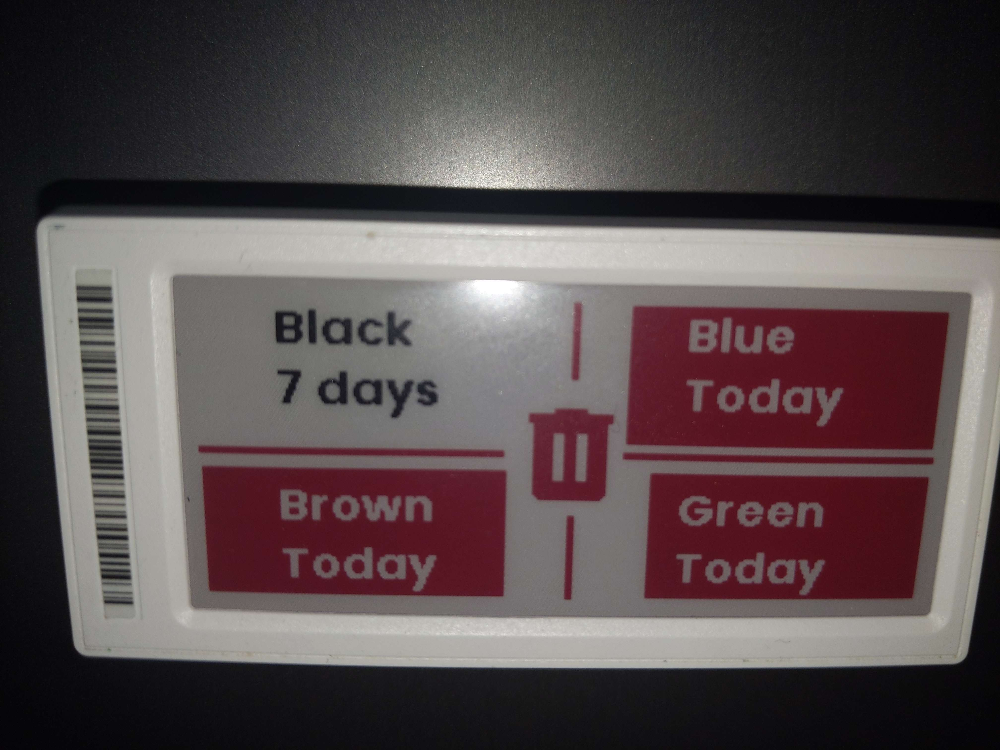

This folder contains code used with the [https://github.com/jonasniesner/open_epaper_link_homeassistant](Home Assistant OpenEPaperLink integration) from @jonasniesner

Contents

waste_collection.yaml - An automation used with the [Waste Collection Schedule](https://github.com/mampfes/hacs_waste_collection_schedule) integration to display which bins (refuse cans) go out each day. Requires some sensors setting up in YAML. See the sample file [OEPL/waste-collection-sample-sensors.yaml] for some examples.

For a full write-up on how to implement the waste-collection tag, see [php-systems' blog](https://blog.php-systems.com/epaper-displays-and-waste-management/). Note that the code on that page might not be as up to date as the code in this repository.
